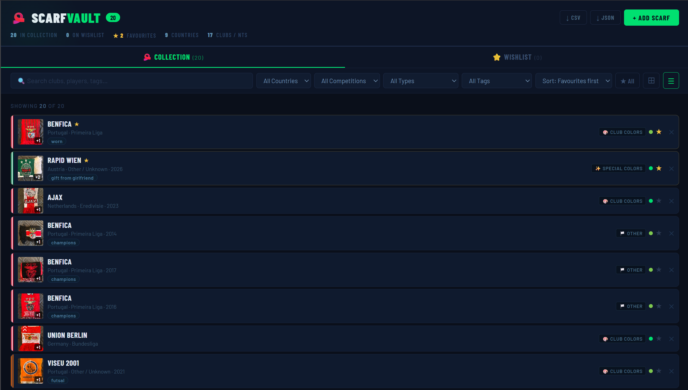
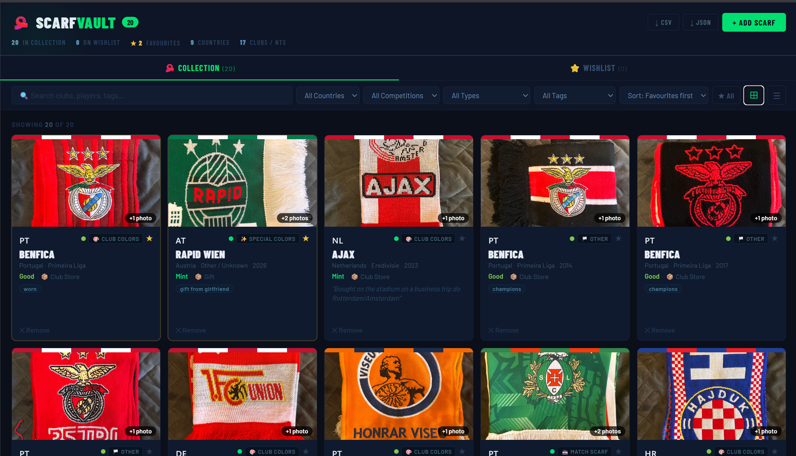
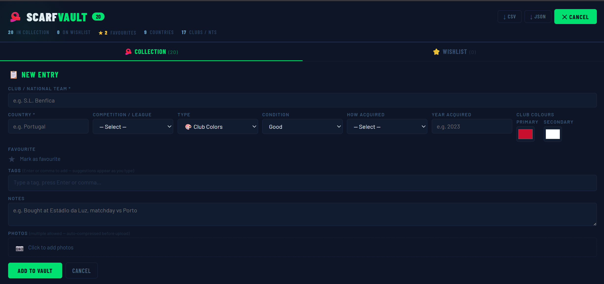

# 🧣 ScarfVault

A self-hosted football scarf collection manager. Track your scarves, upload photos, manage a wishlist, and filter by club, country, competition, type, and tags. Runs on your own server, no third-party accounts needed.

This is a side-project built in about a week for my personal use, and to learn more about Full-Stack Dev, Containerization, and Self-Hosting. Any ideas, criticism, feedback, and improvements are always welcome.

If you like this project and would like to support, you can buy me a coffee!

[](https://ko-fi.com/BRodrigues98)




---

## Features

- Collection and wishlist, with separate tabs but unified search
- Rich metadata: club, country, competition, type, condition, how acquired, year, player name, fixture, custom tags, club colours
- Multiple photos per scarf, compressed client-side before upload (~120KB each), with a full-screen lightbox and keyboard navigation
- Grid or list view, sortable by favourites / A-Z / year / country / condition
- Favourite any scarf with a star, filter to favourites only
- Full-text search across clubs, players, fixtures, tags, and notes; dropdowns for country, competition, type, tag
- CSV export (metadata) and JSON export (full backup)
- Fuzzy matching on the club name field to catch near-duplicates before you add them
- No cloud, no accounts, all data lives in a SQLite database and a photos folder on your machine

---

## Stack

| Layer | Technology |
|---|---|
| Frontend | React 18 + Vite |
| Backend | Node.js + Express |
| Database | SQLite via better-sqlite3 |
| Photos | JPEG files on disk |
| Container | Docker |

---

## Self-hosting with Docker

The recommended way to run ScarfVault. You just need Docker installed.

### 1. Create a `docker-compose.yml`

```yaml
services:
  scarfvault:
    image: brodrigues98/scarfvault:latest
    container_name: scarfvault
    restart: unless-stopped
    ports:
      - "3001:3001"
    volumes:
      - ./data:/app/data
    environment:
      - NODE_ENV=production
      - PORT=3001
      - DATA_DIR=/app/data
```

### 2. Start it

```bash
docker compose up -d
```

The app will be at `http://localhost:3001`. Data is stored in `./data/` on the host and persists across restarts and updates.

### 3. Exposing it externally (optional)

ScarfVault has **no built-in authentication**. If you want to reach it from outside your local network, put it behind something that handles auth. A few options:

- **Cloudflare Tunnel + Cloudflare Access**: free, no port forwarding, adds email/SSO auth in front of the app. This is how I run it.
- **Tailscale**: access it only from devices on your Tailscale network, basically zero config.
- **Nginx + Basic Auth**: a traditional reverse proxy with HTTP basic auth.

> ⚠️ Don't expose port 3001 directly to the internet without auth. There's no login screen.

---

## Updating

```bash
docker compose pull
docker compose up -d
```

Your data stays in `./data/` on the host, so it's untouched by updates.

---

## Backup

Everything lives in `./data/`:

```
data/
├── scarfvault.db      - SQLite database (all metadata)
├── scarfvault.db-shm  - WAL shared memory, include in backups
├── scarfvault.db-wal  - WAL log, include in backups
└── photos/
    └── {scarf_id}/
        └── {timestamp}_{n}.jpg
```

> ⚠️ Always back up all three `.db*` files together. A `.db` without its WAL files may be incomplete.

```bash
rsync -av your-server-ip:/path/to/data/ ./scarfvault-backup/
```

---

## NAS and home server deployment

Works well on low-power home servers. Tested on [ZimaOS](https://www.zimaspace.com/zimaos) (ZimaCube) via manual Docker Compose import. Should run fine on anything that supports Docker: Synology, QNAP, Unraid, TrueNAS SCALE, Umbrel, etc.

---

## Local development

You need Node.js 20+.

**Terminal 1 - backend:**
```bash
cd server
npm install
node --watch index.js
# Runs on http://localhost:3001
```

**Terminal 2 - frontend:**
```bash
cd client
npm install
npm run dev
# Runs on http://localhost:5173
# API calls proxy to :3001 automatically (vite.config.js)
```

### Building the Docker image locally

```bash
docker build -t scarfvault:local .
docker run -p 3001:3001 -v ./data:/app/data scarfvault:local
```

---

## API reference

| Method | Path | Description |
|---|---|---|
| GET | `/api/scarves` | List all scarves with photo URLs |
| POST | `/api/scarves` | Create a scarf |
| DELETE | `/api/scarves/:id` | Delete scarf and all its photos |
| PATCH | `/api/scarves/:id/favorite` | Toggle favourite |
| POST | `/api/scarves/:id/photos` | Upload photos (base64 JSON body) |
| DELETE | `/api/scarves/:id/photos/:filename` | Delete a single photo |
| GET | `/api/health` | Health check |
| GET | `/photos/:id/:filename` | Serve a photo file |

---

## Project structure

```
scarfvault/
├── client/src/
│   ├── App.jsx          Main component: all state, filtering, CRUD
│   ├── api.js           Data layer: the only file that calls fetch()
│   ├── constants.js     Static data: leagues, types, flags, etc.
│   ├── utils.js         Pure functions: fuzzy match, image compression
│   └── components/
│       ├── Lightbox.jsx
│       ├── ScarfCard.jsx
│       ├── ScarfRow.jsx
│       └── TagInput.jsx
└── server/
    ├── index.js         Express app, middleware, static serving
    ├── db.js            SQLite setup, schema, prepared statements
    └── routes/
        └── scarves.js   All API route handlers
```

`api.js` is the only file that talks to the backend. If you fork this and swap out the API, only `api.js` needs changing and the React components stay untouched.

---

## Roadmap

Things not built yet:

- ~~Edit existing scarves (currently add/delete only, no update)~~ ✅ Edit button on each card and row opens the form pre-populated with the scarf's current data. Supports updating all metadata fields and adding/removing photos. Implemented via `PATCH /api/scarves/:id`.
- Photo management on existing scarves (add/remove after creation)
- JSON import via UI (restore a backup without terminal access)
- Map view with a pin per scarf, using Leaflet.js + OpenStreetMap Nominatim
- Player profile view: tap a player name to see all scarves tied to that player


---

## Contributing

Issues and PRs are welcome. This is a side project so I can't promise fast responses, but I'll look at genuine bug reports and well-scoped contributions.

If you find it useful, a coffee is always appreciated.

[](https://ko-fi.com/BRodrigues98)

---

## License

Copyright © 2026 Bruno Rodrigues

[](https://www.gnu.org/licenses/gpl-3.0)

